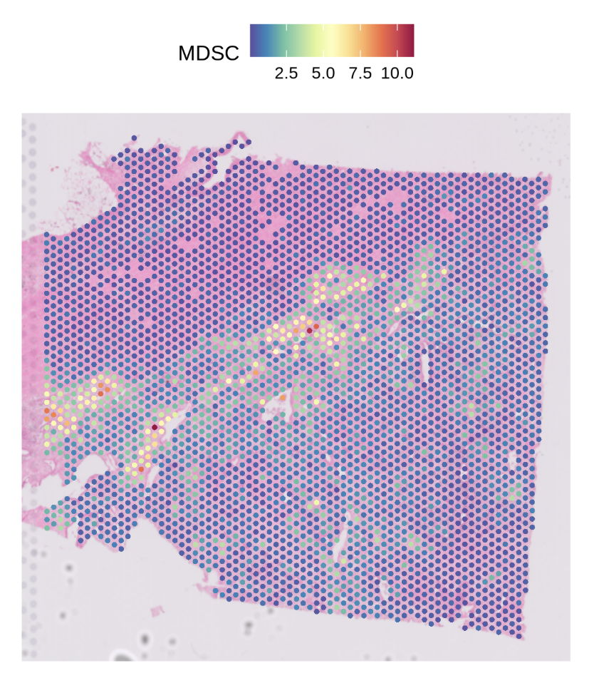
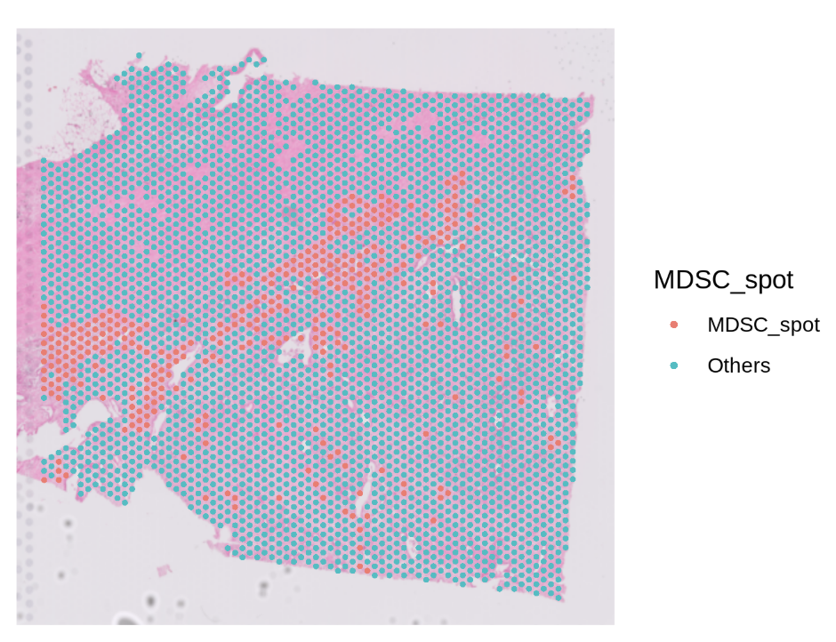
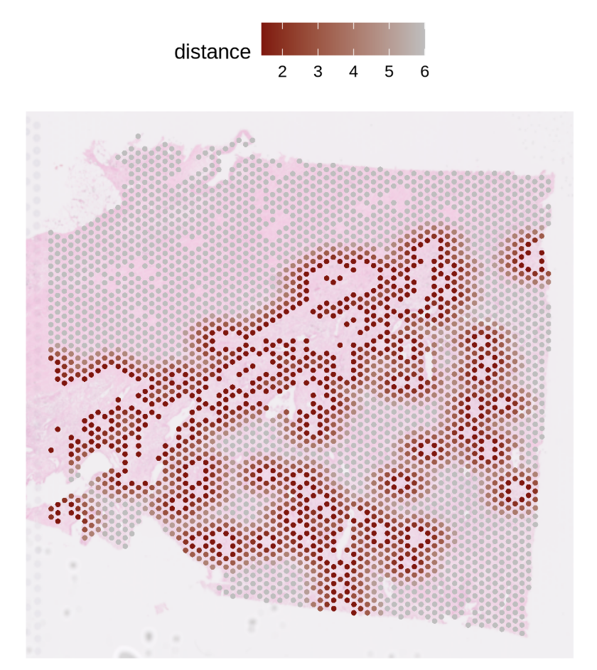
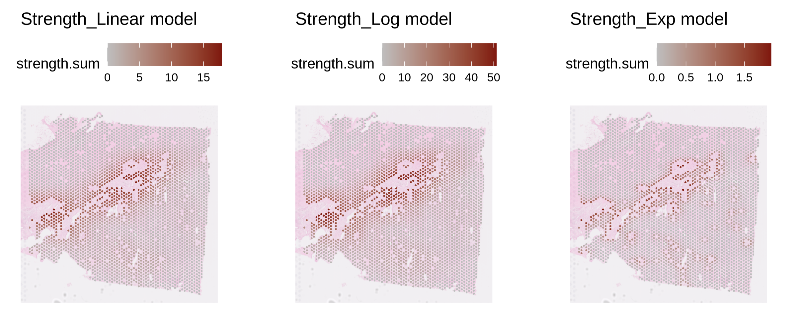
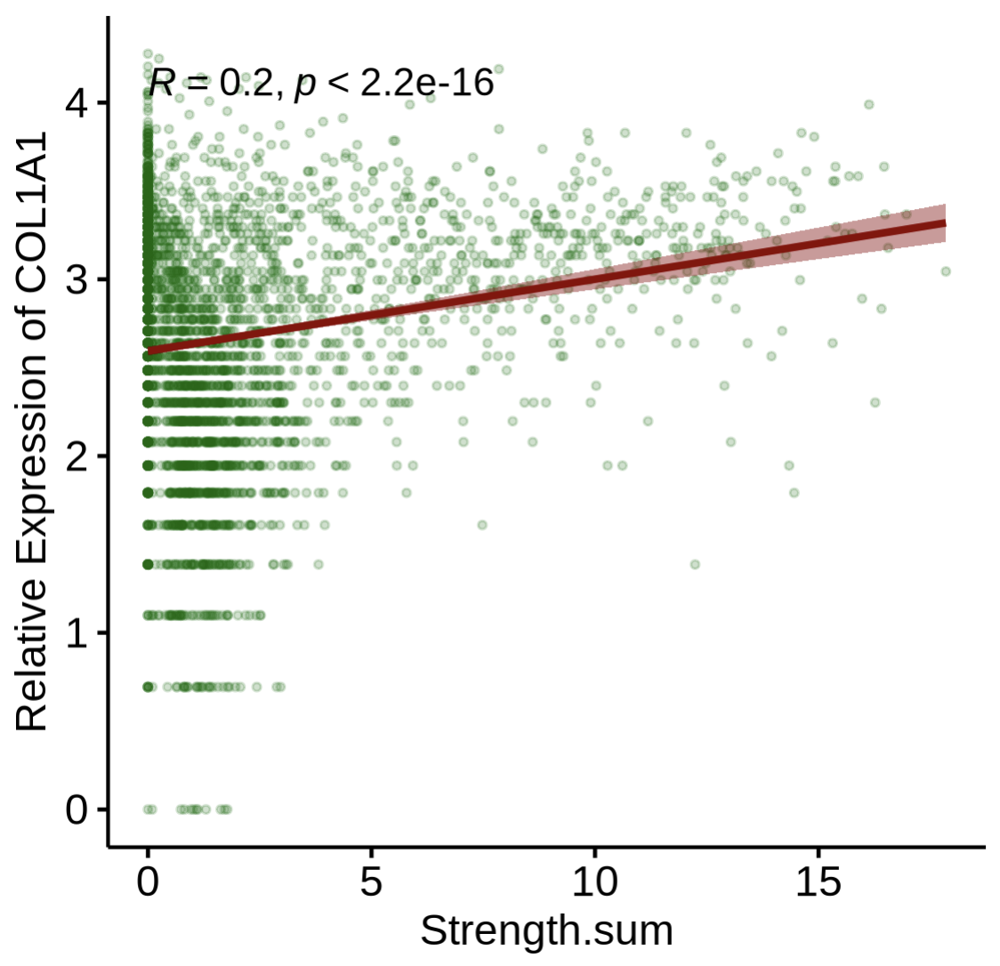
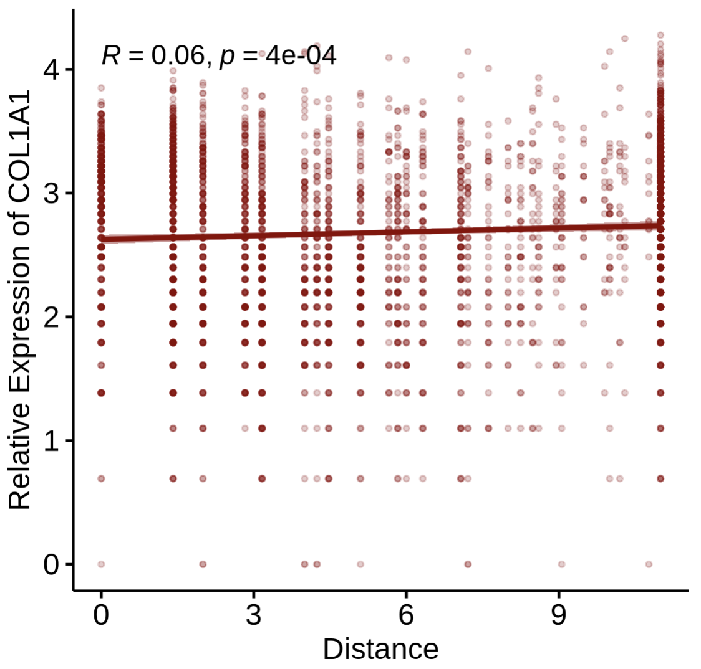
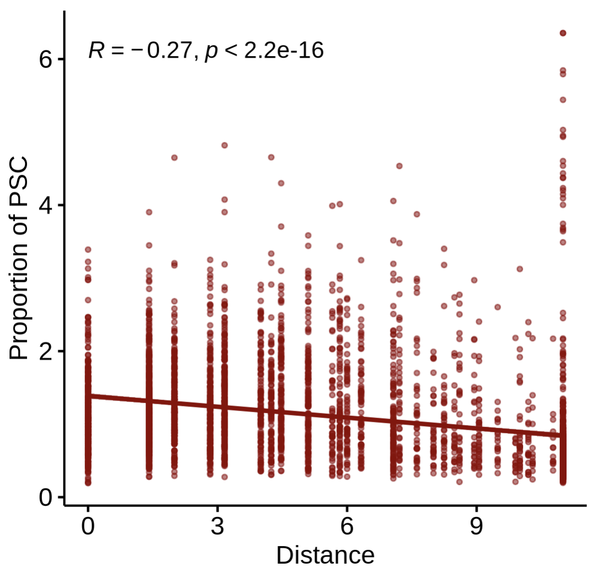

# 10x Visium Tutorial (PDAC demo)

This page demonstrates a **minimal, runnable (“dry-run”) object → Step1–Step4** workflow to showcase how `stGrads` analyzes 10x **Visium** data.  
The demo dataset references: Khaliq AM, Rajamohan M, Saeed O, _et al._ (2024) _Nat Genet._ 56(11):2455–2465. doi:10.1038/s41588-024-01914-4.

---

## Prepare a lightweight Visium object

> Use any Visium sample’s Space Ranger `outs/` folder. Below is a **small, fast** setup to get a dry-run object called `st1.t1`.  The sample was used in 
> If you already have `st1.t1` built elsewhere, skip to **Step1**.

```r
# Core packages
library(Seurat)
library(ggplot2)
library(patchwork)

# stGrads package
# If your package is installed with namespace 'stGrads', use:
library(stGrads)
#! If you have download the PDAC_update.rds 

# Example directory structure
# data/PDAC/
#   └─ Patient01_Primary/
#        └─ outs/
#             ├─ filtered_feature_bc_matrix.h5
#             └─ spatial/
#                 ├─ tissue_lowres_image.png
#                 ├─ scalefactors_json.json
#                 └─ tissue_positions.csv (or tissue_positions_list.csv)

data_root <- "data/PDAC"
sample_id <- "IU_PDA_T1"

st1.t1 <- Load10X_Spatial(
  data.dir = file.path(data_root, sample_id, "outs"),
  filename = "filtered_feature_bc_matrix.h5",
  assay    = "Spatial",
  slice    = sample_id,
  filter.matrix = TRUE
)

# Optional: subset to speed up demo (e.g., keep 300–500 spots)
if (ncol(st1.t1) > 500) {
  set.seed(1113)
  st1.t1 <- subset(st1.t1, cells = sample(colnames(st1.t1), 500))
}

SpatialFeaturePlot(st1.t1,features = 'MDSC',pt.size.factor = 4e3)
```



------

## Run the stGrads Visium Demo (Step1–Step4)

> The following steps mirror your `Demo_for_Visium.r`.
>  Each step begins with a `###` header and includes compact notes about arguments and expected outputs.

------

### Step1 — Find primary infiltration spots of a target cell type

**Goal:** identify “primary” spots for a chosen cell type (e.g., **MDSC**) based on cell type proportion and a quantile cutoff.
 **Key args:**

- `celltype_prop`: column storing the **proportion** of a specific cell type per spot.
- `celltype`: name of the new **classification** column to write (e.g., `"MDSC_spot"`).
- `probs`: quantile cutoff (e.g., `0.9` means top 10% by proportion → labeled as primary).

```R
# Find primary infiltration spots of neutrophils (here using MDSC as the example)
# celltype_prop: given proportion column for target cell type
# celltype: output label column
# probs: quantile cutoff (q90)
st1.t1 <- FindPrimSpot(
  seurat.obj   = st1.t1,
  celltype_prop = 'MDSC',
  celltype      = 'MDSC_spot',
  probs         = 0.9
)

# Inspect classification counts (example output is illustrative)
table(st1.t1$MDSC_spot)
# MDSC_spot  Others
# 353        3177
```



------

### Step2 — Compute nearest-spot distances and (optionally) interaction strength

**Goal:** for each “primary” (reference) spot, compute nearest neighbors (by ring distance) and optionally a **strength** metric based on a chosen model.
 **Key args:**

- `celltype`: the classification column created in **Step1** (e.g., `"MDSC_spot"`).
- `pheno_choose`: list of specific reference spots (generally **NOT recommended**, keep `NULL`).
- `calc.strength`: whether to calculate strength between reference and neighbors.
- `model`: `'Linear' | 'Log' | 'Exp'` strength decay model.
- `max.r`: how many distance rings to evaluate (Visium tip: `max.r = 4` ≈ 200 μm if spot pitch ≈ 55 μm).


```R
df.res <- CalcNearDis(
  st1.t1,
  celltype      = 'MDSC_spot',
  pheno_choose  = NULL,       # NOT RECOMMENDED now
  calc.strength = TRUE,
  model         = 'Linear',   # 'Linear' | 'Log' | 'Exp'
  max.r         = 10          # for Visium you can use 4; here 10 shows a wider range
)

# df.res is a data.frame summarizing nearest-ring relationships (and strength if requested)
head(df.res)

```


### Step3 — Visualization (basic distance map)

**Goal:** visualize nearest-spot **distance rings** around primary (reference) spots.

```R
PlotNearDis(
  st1.t1,
  nearest_ref_info = df.res,
  color            = c('darkred','gray'),
  shape            = 21,
  max.dis          = 6,
  image.alpha      = 0.5,
  pt.size.factor   = 4e3
)

```



### Step3 — Visualization (interaction strength map)

**Goal:** visualize the **strength** profile (as defined in Step2) from reference to neighbors.

```R
PlotStrengthDis(
  st1.t1,
  df.res,
  color        = c('gray','darkred'),
  image.alpha  = 0.5,
  pt.size.factor = 4e3
)
```



### Step4-1 — Correlate **gene expression** with **interaction strength**

**Goal:** examine how gene expression relates to computed **strength**.
 **Key args:**

- `layer`/`assay`: which data layer/assay to read expression from (e.g., `layer='data'`, `assay='SCT'`).
- `gene`: gene symbol of interest (e.g., `"COL1A1"` in PDAC stromal context).

```R
PlotStrengthExpr(
  st1.t1,
  df.res,
  image.alpha    = 0.5,
  pt.size.factor = 4e3,
  layer          = 'data',
  assay          = 'SCT',
  gene           = 'COL1A1'
)
```



------

### Step4-2 — Correlate **gene expression** with **distance**

**Goal:** relate expression to **distance** (rather than strength) from reference spots.

```R
PlotDisExpr(
  st1.t1,
  df.res,
  ref_col   = c('darkred'),
  gene      = 'COL1A1',
  log.trans = FALSE
)
```



------

### Step4-3 — Correlate **cell-type proportion** with **distance**

**Goal:** test whether the **proportion** of another cell type changes with distance from the reference spots.

```R
PlotDisProp(
  st1.t1,
  df.res,
  ref_col    = c('darkred'),
  prop_cell  = 'PSC'     # name of the proportion column for the target cell type
)
```



------

## Tips & Notes

- **Reference label**: ensure the Step1 label (`'MDSC_spot'`) indeed contains the “primary” references.
- **Distance scale**: for Visium, `max.r = 4` is often a good biological radius (~200 μm); tune to your tissue.
- **Model choice**: `'Linear'`, `'Log'`, and `'Exp'` encode different decay assumptions for strength—pick what best matches your biology.
- **Reproducibility**: fix a random seed if you subselect spots for demos; re-run on full data for publication figures.

------

## Session info

```R
sessionInfo()

R version 4.3.3 (2024-02-29)
Platform: x86_64-conda-linux-gnu (64-bit)
Running under: CentOS Linux 7 (Core)

attached base packages:
[1] stats     graphics  grDevices utils     datasets  methods   base     

other attached packages:
[1] ggpubr_0.6.0       ggplot2_3.5.1      stringr_1.5.1      Seurat_5.3.0      
[5] SeuratObject_5.2.0 sp_2.1-4           stGrads_0.1.1     
```