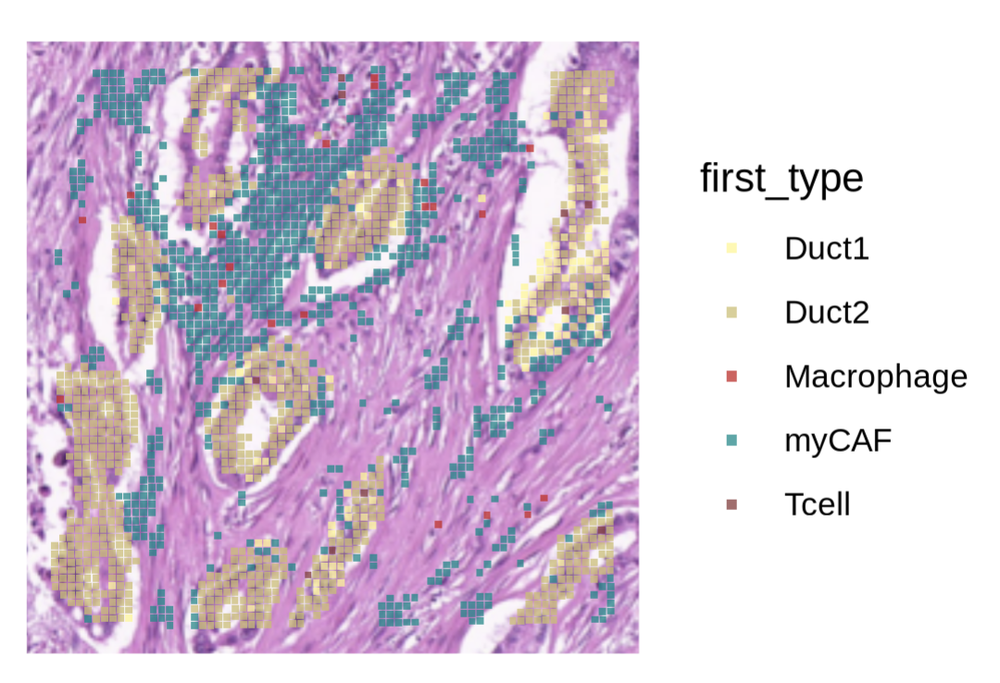
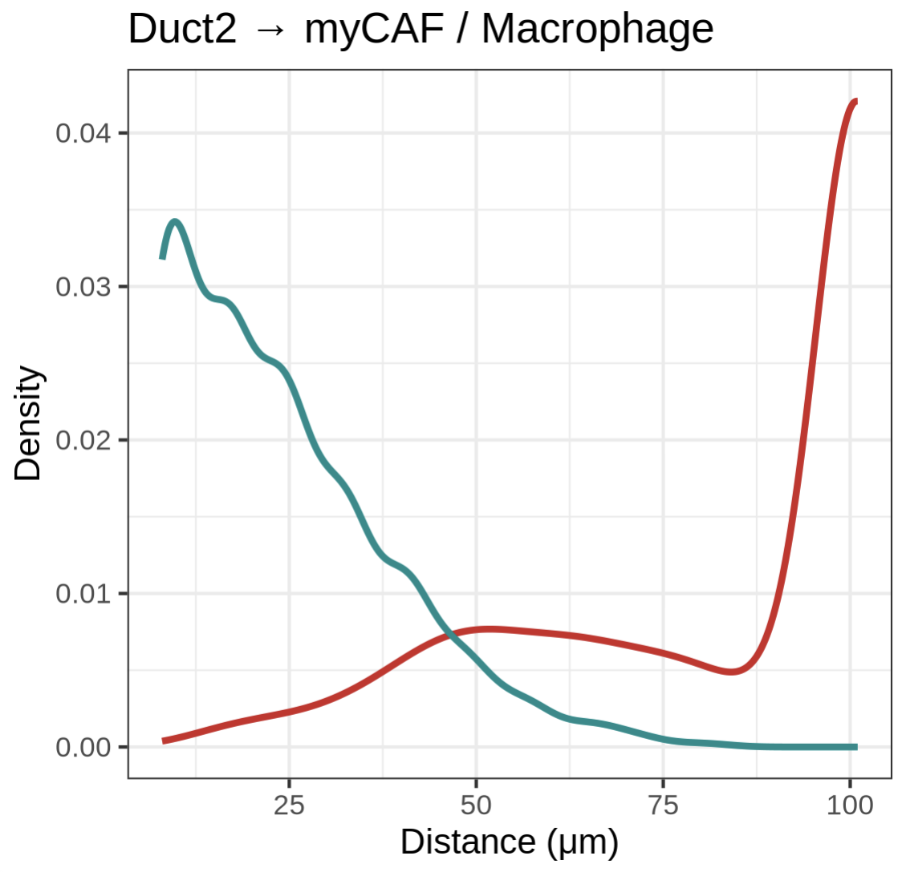
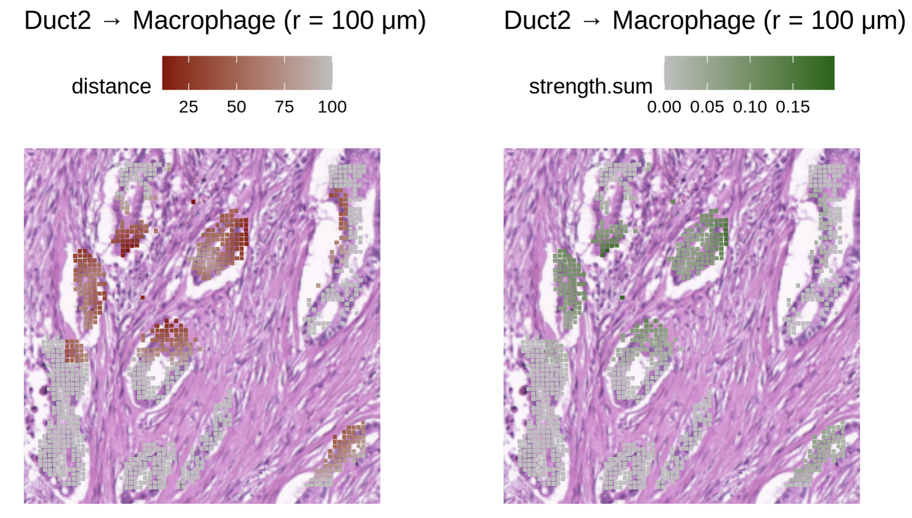
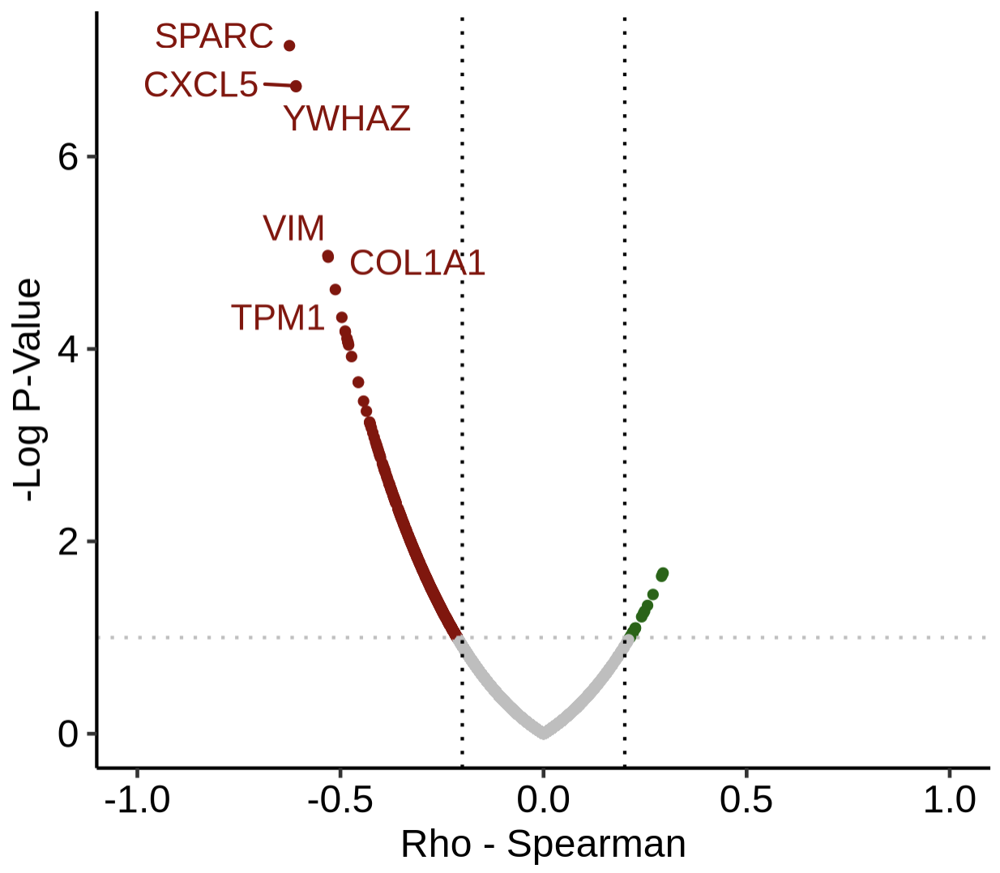
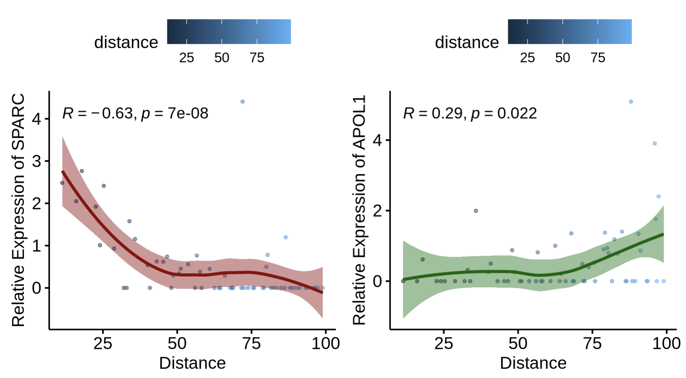

# 10x Visium HD Tutorial (internal datasets)

This page demonstrates the **Visium HD** workflow with `stGrads` in the same **Step1–Step4** style as the Visium tutorial.  
We will load an internal HD Seurat object from a supplementary `.rds` file, compute distance/strength matrices, visualize spatial maps, and identify distance-related genes (DRGs).

---

## Prepare environment & load the HD object

> Load required packages and read the demo Seurat object (e.g., `HD_demo_1.rds`) shipped as a supplementary file. We also render a quick spatial overview for context.

```r
set.seed(1113)
library(Seurat)
library(ggplot2)
library(ggsci)
library(stringr)

library(stGrads)

options(future.globals.maxSize = 10*1024^3)

# ---- Load Visium HD Seurat object ----
st.hd <- readRDS("HD_demo_1.rds")

# ---- Spatial overview by 'first_type' ----
SpatialDimPlot(
  st.hd,
  group.by       = "first_type",
  image.scale    = "hires",
  crop           = TRUE,
  shape          = 22,  # square spots for HD
  pt.size.factor = 80 * st.hd@images[["slice1"]]@scale.factors[["hires"]],
  alpha          = 0.75
) +
  scale_fill_manual(values = c("#FFF68F","#CDBE70","#CD2626","#008B8B","#8B3A3A"))
```



------

## Run the stGrads Visium HD Demo (Step1–Step4)

> The following steps mirror the Visium tutorial’s structure and incorporate your HD demo code.

------

### Step1 — Compute ring-distance matrices from a query cell type

**Goal:** quantify distances (in μm) from **query** spots (e.g., `Duct2`) to specific **reference phenotypes** (e.g., `myCAF`, `Macrophage`) using HD-aware geometry.
 **Key args:**

- `celltype`: metadata column storing cell/phenotype labels (here `"first_type"`).
- `query_celltype`: the focal class whose distances you’ll measure **from** (e.g., `"Duct2"`).
- `pheno_choose`: the **reference** phenotype to measure distances **to** (e.g., `"myCAF"`).
- `max.r`: radius cutoff (μm).
- `resolution`: grid resolution (tune to HD spot density).

```R
# ---- Distances: Duct2 -> myCAF ----
dis_mtx.Duct2_myCAF <- CalcNearDis_HD(
  st.hd,
  celltype       = "first_type",
  query_celltype = "Duct2",
  pheno_choose   = "myCAF",
  max.r          = 100,
  resolution     = 8
)

##[1] "Ref_spots numbers is:912"
##[1] "Query_spots numbers is:977"

# ---- Distances: Duct2 -> Macrophage ----
dis_mtx.Duct2_Mp <- CalcNearDis_HD(
  st.hd,
  celltype       = "first_type",
  query_celltype = "Duct2",
  pheno_choose   = "Macrophage",
  max.r          = 100,
  resolution     = 8
)

##[1] "Ref_spots numbers is:22"
##[1] "Query_spots numbers is:977"

# Combine for inspection/plot
dis_mtx.Duct2_myCAF$ref <- "myCAF"
dis_mtx.Duct2_Mp$ref    <- "Macrophage"
dff <- rbind(dis_mtx.Duct2_myCAF, dis_mtx.Duct2_Mp)
dff$distance <- as.numeric(dff$distance)

# Distance distribution (μm)
ggplot(dff) +
  geom_density(aes(x = distance, colour = ref), linewidth = 1) +
  theme_bw() +
  labs(title = "Duct2 → myCAF / Macrophage (r = 100 μm)", x = "Distance (μm)", y = "Density") +
  theme(legend.position = "none") +
  scale_color_manual(values = c("#CD2626","#008B8B"))

```



------

### Step2 — (Optional) Compute interaction **strength** with a decay model

**Goal:** in addition to distances, estimate **interaction strength** from the query to reference spots using a chosen decay model.
 **Key args:**

- `calc.strength = TRUE` to enable strength computation.
- `model`: `"Linear" | "Log" | "Exp"` selects how strength decays with distance.
- Normalize to [0,1] for easy plotting.

```R
# ---- Strengths: Duct2 -> myCAF ----
stg_mtx.Duct2_myCAF <- CalcNearDis_HD(
  st.hd,
  celltype       = "first_type",
  query_celltype = "Duct2",
  pheno_choose   = "myCAF",
  max.r          = 100,
  resolution     = 8,
  calc.strength  = TRUE,
  model          = "Linear"
)

# ---- Strengths: Duct2 -> Macrophage ----
stg_mtx.Duct2_Mp <- CalcNearDis_HD(
  st.hd,
  celltype       = "first_type",
  query_celltype = "Duct2",
  pheno_choose   = "Macrophage",
  max.r          = 100,
  resolution     = 8,
  calc.strength  = TRUE,
  model          = "Linear"
)

stg_mtx.Duct2_myCAF$ref <- "myCAF"
stg_mtx.Duct2_Mp$ref    <- "Macrophage"
dff.stg <- rbind(stg_mtx.Duct2_myCAF, stg_mtx.Duct2_Mp)

# Normalize summed strength for visualization
dff.stg$strength.sum <- dff.stg$strength.sum / max(dff.stg$strength.sum, na.rm = TRUE)

# Example density plot (uncomment to render)
# ggplot(dff.stg) +
#   geom_density(aes(x = strength.sum, colour = ref), linewidth = 2) +
#   theme_bw() +
#   labs(title = "Duct2 → myCAF / Macrophage (r = 100 μm)", x = "Relative Strength", y = "Density") +
#   theme(legend.position = "none") +
#   scale_color_manual(values = c("#CD2626","#008B8B"))

```


------

### Step3 — Spatial maps: distance rings & interaction strength

**Goal:** draw **distance rings** and **strength** maps on the HD tissue image.
 **Tips:**

- Use `img.use = "hires"` and square `shape = 22` for HD.
- Scale point size with `hires` scale factor.

```R
#! if met error: 
#		Error in slot(from, what) : 
#  	no slot of name "misc" for this object of class #	"VisiumV2"

#!RUN:
#		st.hd <- UpdateSeuratObject(st.hd)


# ---- Distance rings: Duct2 -> Macrophage (r = 100 μm) ----
PlotNearDis(
  st.hd,
  nearest_ref_info = dis_mtx.Duct2_Mp,
  max.dis       = 100,
  color         = c("darkred","gray"),
  shape         = 22,
  img.use       = "hires",
  image.alpha   = 1,
  pt.size.factor = 80 * st.hd@images[["slice1"]]@scale.factors[["hires"]]
) + labs(title = "Duct2 → Macrophage (r = 100 μm)")

# ---- Strength map: Duct2 -> Macrophage (r = 100 μm) ----
PlotStrengthDis(
  st.hd,
  nearest_ref_info = stg_mtx.Duct2_Mp,
  max.dis       = 100,
  color         = c("gray","darkgreen"),
  shape         = 22,
  img.use       = "hires",
  image.alpha   = 1,
  pt.size.factor = 80 * st.hd@images[["slice1"]]@scale.factors[["hires"]]
) + labs(title = "Duct2 → Macrophage (r = 100 μm)")

```



------

### Step4 — Downstream: DRGs and distance–expression relationships

**Goal:** identify **Distance-Related Genes (DRGs)** with `CalcDRG`, then visualize how expression changes with distance from the reference.

```R
# ---- Find DRGs (Distance-Related Genes) ----
st.hd <- NormalizeData(st.hd)

DRGs <- CalcDRG(
  st.hd,
  nearest_ref_info = dis_mtx.Duct2_Mp,
  layer      = "data",
  assay      = "Spatial",
  pthresh    = 1,
  log.trans  = FALSE,
  filt_root  = TRUE,
  filt_far   = 100
)

head(DRGs)

# rho     pvalue
# NOC2L   -0.09532062 0.46493640
# KLHL17  -0.05884603 0.65236098
# PLEKHN1  0.08831333 0.49853035
# HES4    -0.23190598 0.07211730
# ISG15   -0.31018989 0.01497929
# AGRN    -0.12869089 0.32294101


PlotDRGs(DRGs)

```



```R
# ---- Distance vs expression: example genes ----

# SPARC vs distance (Duct2 -> Macrophage)
PlotDisExpr(
  seurat.obj       = st.hd,
  nearest_ref_info = dis_mtx.Duct2_Mp,
  ref_col   = "distance",
  assay     = "Spatial",
  gene      = "SPARC",
  col       = "darkred",
  log.trans = FALSE,
  filt_root = TRUE,
  filt_far  = 100
)

# APOL1 vs distance (Duct2 -> Macrophage)
PlotDisExpr(
  seurat.obj       = st.hd,
  nearest_ref_info = dis_mtx.Duct2_Mp,
  ref_col   = "distance",
  assay     = "Spatial",
  gene      = "APOL1",
  col       = "darkgreen",
  log.trans = FALSE,
  filt_root = TRUE,
  filt_far  = 100
)

```



------

## Notes

- **HD specifics:** `img.use = "hires"` and `shape = 22` better match HD spot geometry; scale point size with the **hires** factor.
- **Radius/model:** choose `max.r` (μm) and `model` (Linear/Log/Exp) to fit your biological interaction range.
- **Metadata:** ensure `first_type` contains correct annotations (e.g., `Duct2`, `myCAF`, `Macrophage`).
- **Reproducibility:** for publication, run on the full object (no downsampling) and fix random seeds where applicable.

------

## Session info

```R
sessionInfo()
```

